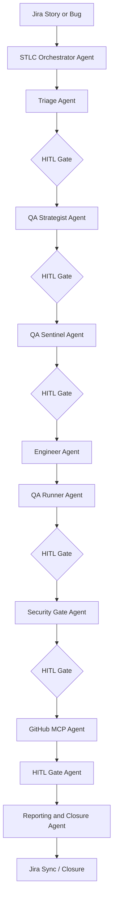

# EPAM STLC Enterprise Multi-Agent System

This repository defines a full 8-phase enterprise STLC flow with one main orchestrator agent, stage-specific subagents, MCP integration placeholders, HITL approval gates, and security posture controls.

## Structure

- `.claude/` holds Claude configuration, agent prompts, hooks, and reusable skills
- `.claude/config/` holds the project manifest and MCP connection placeholders
- `artifacts/` holds the phase outputs for all 8 STLC stages
- `workflow/` holds the Java orchestration entrypoint for the multi-agent STLC flow

## Agent Model

- Main orchestrator: `.claude/agents/stlc-orchestrator-agent.md`
- Stage subagents: `.claude/agents/*.md`
- Reusable skills: `.claude/skills/*.md`
- Command entry points: `.claude/commands/*.md`
- Validation and policy hooks: `.claude/hooks/*.py`

## Command Package

- `.claude/commands/mcp-preflight.md` runs the Phase 0 MCP readiness check.
- `.claude/commands/stlc.md` runs the full end-to-end STLC flow.
- `.claude/commands/01-requirements-analysis.md` through `.claude/commands/08-closure-sync.md` expose phase-specific entry points.
- Commands should invoke reusable capabilities through the Skill tool by skill name rather than reading skill files directly.

## End-to-End Flow

1. Stage 1 ingests Jira requirements and produces requirement analysis.
2. Stage 2 turns approved analysis into a risk-based plan.
3. Stage 3 generates BDD and test design assets.
4. Stage 4 coordinates engineering and execution evidence.
5. Stage 5 applies security and compliance review.
6. Stage 6 prepares PR and automated review actions.
7. Stage 7 enforces human approval and records the audit trail.
8. Stage 8 prepares closure metrics and Jira sync-ready outputs.

## Architecture Diagram

## MCP Integrations

- Jira MCP placeholder: `.claude/config/mcp/jira_mcp_config.json`
- GitHub MCP placeholder: `.claude/config/mcp/github_mcp_config.json`
- Both are disabled by default until explicitly approved.

## HITL Gates

- Human approval is required before each execution-bearing phase.
- Stage 7 is the explicit audit and approval checkpoint.
- Hooks enforce approval mode and artifact availability before progression.

## Security Posture

- Live integrations remain disabled by default.
- Secrets are stored as references only.
- Repository mutation, scan execution, PR creation, and Jira sync require explicit approval.
- Evidence artifacts are required for downstream progression.

## Live Demo Path

Use the orchestrator with placeholder Jira and GitHub inputs to demonstrate:

1. intake into `artifacts/requirement_analysis.md`
2. phase-by-phase artifact generation through all 8 stages
3. HITL stop/go control at each gated transition
4. final closure output in `artifacts/test_closure_metrics.md`

## Demo Dashboard

- Demo report: `artifacts/stlc_dashboard_demo.html`
- Sample data contract: `artifacts/dashboard_data.sample.json`
- The HTML report is intentionally standalone so it can be opened directly in a browser during a demo.
- For live demos, the executor can inject real telemetry into `window.STLC_DASHBOARD_DATA` or generate the same JSON shape before opening the report.
- Token usage is currently sample data only and should be replaced by runtime telemetry when available.

Removed legacy content:

- root-level `config/`, `docs/`, `hooks/`, `mcp/`, `skills/`, and `stages/`
- duplicate agent package trees under `.claude/packages/`
- duplicate nested agents under `.claude/agents/stlc-pipeline/`
- generated build output under `target/`

## Human-in-the-Loop Policy

- No live integration is enabled by default
- Human approval is required before stage execution, repository mutation, PR creation, or Jira synchronization
- Placeholder values are used until you provide real Jira, GitHub, and scanner details

## Current Status

- `.claude/config/project.json` is the active agentic flow manifest
- `.claude/agents/stlc-orchestrator-agent.md` is the main orchestration prompt
- `workflow/STLCWorkflowOrchestrator.java` is the active stage graph source
- `artifacts/` files are the phase outputs the runtime can populate
- agent execution logic is intentionally left to your runtime layer
